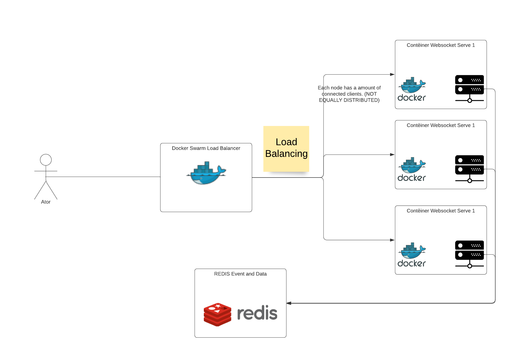

# Websocket server cluster

This is a PoC of something i've been learning about.

Socket technology makes me i'm very excited. In the current scenario of scalable applications, kubernetes, aws ecs, etc, i've been wondering how could i scale a websocket server, keeping the clients in the same context, without losing the atomicity of the data.

The first thing i realized is that to accomplish that i cannot make my server stateful. Every single piece of data needs to be readable and writable by every server node in the cluster. For this i choose Redis as a stateful, accessible and fast database. (Not implemented yet).

Every application built with websocket has it own specific purposes and details. But there's a pattern that is present is most of them: incoming and outgoing messages

Depending the logic or domain of the application concept, the message exchange between the client and server may have to be know from all the nodes or just the one who received the **event**.



## Events

In order to handle the communication between server, client and the cluster environment in easier and flexible way, the concept of Event is a great option to be adopted.

Every when a node receive a new message from one of its connected clients, it is assumed as a event. The content of the message will then say what kind of event it is, and then the server decides what to do with that information.

The middleware that receive and broadcasts the event to the nodes is also Redis, with the PubSub tool, it makes much easier to publish a new event.

## Technologies

- NodeJS as backend
- Ts-Node for typescript compiling
- Redis as state database and event listener and broadcast
- Docker Swarm for deploying replicas of the websocket server isolated in a container
  

## Run the application

### Requirements

You have to ensure to have docker swarm enabled

```sh
docker swarm init
```

To run in swarm mode you need to have a redis server started and configure the address into the [Compose file](./dev-stack.yml)
```yaml
      - ./src:/app/src
    environment:
      SERVER_PORT: '3000'
      REDIS_SERVER: redis://localhost:6379 <--

    ports:
```

### Build

First the image need be built
```sh
$ docker build . -t wss
```

### Run as dev

To run a single instance you can use command below:
```sh
REDIS_SERVER=redis://localhost:6379 yarn dev
```
this will open the server in a random available port

optionally if you want to run multiple instances with different ports you can use
```sh
SERVER_PORT=3002 REDIS_SERVER=redis://localhost:6379 yarn dev
```
### Deploy

You can set the amount of replicas on the stack file 
```yaml
    image: wss
    deploy:
      replicas: 3 <--
    volumes:
```

Use this command to deploy the stack
```
docker stack deploy -c dev-stack.yml
```

